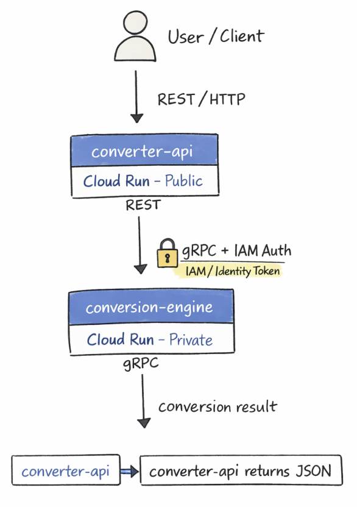
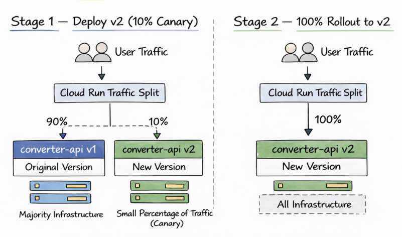

# Lab5_CloudRun_and_ExtraCredit
Lab 5 – gRPC conversion engine, REST API, Cloud Run deployment, and canary rollout
---

# Lab Execution Screenshots

## 1. Environment Setup

This screenshot shows the initial environment setup for the lab. The necessary tools and project files are prepared so the microservices can be developed and deployed.

---

## 2. Clone Repository and Virtual Environment

The repository for the lab is cloned and a Python virtual environment is created. This ensures that all dependencies are installed in an isolated environment for the project.

---

## 3. gRPC Install and Restore Script

This step installs the required gRPC libraries and runs the restore script to configure the project environment. These tools are needed for communication between the API service and the conversion engine.

---

## 4. Restore Script Environment

The restore script completes the environment setup by installing any additional dependencies needed for the project. This ensures the services can run correctly before building containers.

---

## 5. gRPC Contract and Stub Generation

The protocol buffer contract is compiled to generate the gRPC client and server stubs. These generated files allow the converter API to communicate with the conversion engine through gRPC.

---

## 6. Conversion Logic and Validation

This screenshot shows the implementation of the conversion logic and input validation. The system checks that units belong to the same category before performing a conversion.

---

## 7. Container Build and Push

The conversion engine microservice is built into a Docker container and pushed to the container registry. This container image will later be deployed to Google Cloud Run.

---

## 8. Conversion Engine Cloud Run Deployment

The conversion engine container is deployed to Google Cloud Run. This creates the backend service responsible for performing unit conversions.

---

## 9. Converter API Container Build

The converter API service is built as a container image. This service acts as the public interface that users interact with when requesting conversions.

---

## 10. Converter API Cloud Run Deployment

The converter API container is deployed to Cloud Run. This step makes the API accessible so it can receive HTTP requests and forward them to the conversion engine.

---

## 11. Service-to-Service IAM

IAM permissions are configured so that the converter API can securely call the conversion engine service. This allows internal communication between the microservices while keeping the conversion engine private.

---

## 12. Successful API Conversion

A successful conversion request is sent to the API and the correct result is returned. This confirms that the REST API and gRPC conversion engine are communicating correctly.

---

## 13. Multiple Conversions and Error Handling

Multiple conversion requests are tested, including an invalid conversion attempt. The system correctly handles valid conversions and returns an error when incompatible units are used.

---

## Cleanup

This screenshot shows the cleanup step where the deployed Cloud Run services are deleted. This ensures that no unnecessary cloud resources remain running after the lab is completed.

---

# Extra Credit – Canary Deployment

The extra credit demonstrates how a new version of a service can be deployed gradually using a canary rollout strategy.

---

## EC 1 – Current Revision and Baseline Test

The current revision of the converter API is checked and a baseline conversion test is performed. This confirms that the original version of the service is working correctly before deploying a new version.

---

## EC 2 – Build v2 Container

A new container image for version 2 of the converter API is built and pushed to the container registry. This prepares the updated version for deployment.

---

## EC 3 – Deploy v2 With No Traffic

Version 2 of the API is deployed as a new Cloud Run revision but receives no traffic initially. This allows the new version to be tested without affecting users.

---

## EC 4 – Verify Traffic and Test v2

The tagged URL for version 2 is used to test the new revision directly. This confirms that the new version works before sending real user traffic to it.

---

## EC 5 – Canary 10% Rollout

Traffic is split so that 10% of requests go to version 2 while 90% continue using version 1. This gradual rollout helps verify that the new version works correctly under real traffic.

---

## EC 6 – Full Rollout

After confirming the new version is stable, all traffic is routed to version 2. This completes the deployment of the updated service.

---

## EC 7 – v2 Serving Requests

The final test confirms that requests are now being handled by version 2 of the converter API. This verifies that the canary deployment successfully transitioned the service to the new version.

## Architecture Diagrams

### Lab 5 Microservice Architecture

This diagram shows the architecture that is used in Lab 5. A user sends a request to the public converter-api service that is running on Cloud Run through a REST/HTTP interface. The API then calls the private conversion-engine service using gRPC with IAM authentication, which then performs the conversion and returns the result back to the API as JSON.

---

### Extra Credit – Canary Deployment

This diagram illustrates the canary deployment strategy implemented in the extra credit portion of the lab. Initially, only 10% of traffic is routed to the new v2, while the remaining 90% continues using the original v1 version. After monitoring the new version and confirming it works correctly, 100% of traffic is shifted to v2, completing the rollout.

# Lab Reflection Questions

## 1. Statelessness and Serverless Platforms

Unit conversion is a stateless workload because each request contains all the information needed to perform the calculation, such as the value and the units. The service does not need to remember anything about previous requests, which makes it ideal for Cloud Run’s scale-to-zero model where containers can start and stop based on demand. An example of a workload that would not work well with this model would be something like a long-running game server or a system that needs to maintain active user sessions in memory.

---

## 2. Two Interfaces, Two Audiences

The public REST interface is defined by the HTTP endpoints exposed by the converter API, such as the /convert route that accepts parameters and returns JSON responses. The internal gRPC interface is defined by the .proto contract used by the conversion engine, which specifies the request and response messages used between services. The intended audience for the REST API is external clients or users, while the gRPC interface is meant for internal service-to-service communication. Separating these contracts helps microservice systems stay modular because internal implementations can change without breaking the public interface used by clients.

---

## 3. Service Responsibilities

Validation is performed in the API layer because it is responsible for handling incoming requests and ensuring that inputs are valid before calling other services. This prevents unnecessary calls to the conversion engine when the request is clearly invalid, such as converting between incompatible unit categories. It shows that microservices should have clearly defined responsibilities, where each service focuses on a specific part of the system.

---

## 4. Secure Service-to-Service Communication

The Converter API proves it is allowed to call the Conversion Engine by sending an identity token generated by its service account. The identity token represents the identity of the calling service and includes an audience field that specifies the intended service receiving the request. Cloud Run checks that the token is valid, that it was issued by Google, and that the service account has permission to invoke the target service. This model is considered zero-trust because every request must be authenticated and authorized, even when communication happens inside the same cloud environment.

---

## 5. Cold Starts and Serverless Behavior

A cold start happens when Cloud Run needs to start a new container instance to handle a request after the service has scaled down to zero. In this system, the first request may trigger two cold starts because both the converter API and the conversion engine containers may need to start. Cloud Run accepts this trade-off because it allows services to scale down when not in use, which reduces infrastructure costs compared to keeping containers running all the time.

---

## 6. Contracts and Evolution of Services

The .proto file is stored in the repository because it defines the contract between services and acts as the source of truth for the API structure. The generated _pb2.py files are not stored because they can always be regenerated from the .proto file when needed. This approach helps services evolve safely over time because developers only need to update the contract and regenerate the code rather than manually maintaining generated files.

---

## 7. Microservice Boundaries and Extensibility

When adding a new feature, the decision depends on the authority of each component in the system. If the feature changes how users interact with the service, it likely belongs in the public API, while internal processing logic would belong in the conversion engine. Changes that affect how services communicate should be reflected in the service contract defined by the .proto file. This structured separation helps teams extend systems without breaking existing functionality or disrupting other services.
